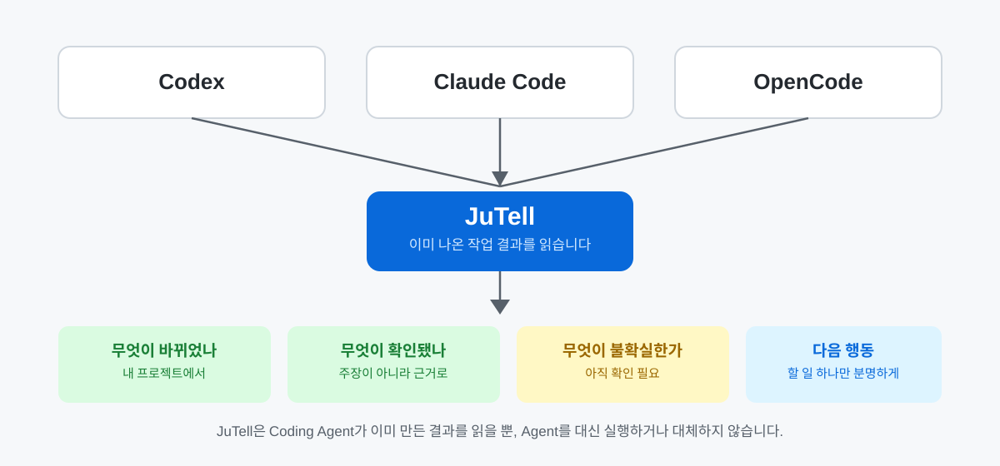

# JuTell — by Ju0

[English](README.md) | **한국어**

**AI가 방금 뭘 바꿨지? JuTell이 알려드립니다.**

Codex, Claude Code, OpenCode 같은 Coding Agent가 일을 끝내면 결과는 대부분 길고 기술적입니다. JuTell은 이미 쓰고 있는 Agent 옆에서 그 결과를 사람이 읽을 수 있는 보고서로 바꿔줍니다 — 뭐가 바뀌었는지, 진짜로 확인된 건 뭔지, 아직 모르는 건 뭔지, 다음에 뭘 하면 되는지를 한곳에서 보여줍니다.



JuTell은 AI 모델도, IDE도, Agent GUI도 아닙니다. Agent를 대신하거나 작업을 중간에서 전달하지 않습니다 — 이미 쓰는 Agent 옆에 붙어서 **설명하고, 확인하고, 다음으로 이어주는** 역할만 합니다.

## 설치

```bash
npm install -g jutell
jutell
```

`jutell`을 실행하면 컴퓨터에 설치된 Coding Agent(Codex, Claude Code, OpenCode)를 찾아서 연결해도 되는지 한 번만 물어봅니다. 승인하면 바로 연결하고, 별도 화면 없이 원래 쓰던 Codex / Claude Code / OpenCode로 돌아갑니다.

<details>
<summary>저장소 소스로 직접 설치하기 (기여자용 / 소스 직접 검증)</summary>

일반 사용자는 위의 npm 설치를 사용하세요. 이 저장소의 소스를 직접 검증할 때만 사용합니다.

```bash
cd packages/cli
npm install
npm pack
npm install -g ./jutell-1.1.0.tgz
```

`1.1.0`은 이 저장소의 현재 소스 버전이며, 현재 npm에 공개된 `jutell@1.1.0`과 같습니다.
</details>

## JuTell이 실제로 하는 일

Agent가 작업을 끝내면 JuTell은 여러분이 진짜 궁금한 것들에 답합니다.

| 궁금한 것 | JuTell이 보여주는 것 |
|---|---|
| 뭐가 바뀌었지? | Diff 나열이 아니라 쉬운 말로 된 요약 |
| 진짜 확인된 건가요? | 실제로 실행한 검증만 — "아마 될 것"은 따로 표시 |
| 아직 모르는 건 뭔가요? | 슬쩍 넘어가지 않고 명확히 표시 |
| 어떤 코드가 중요하고, 왜요? | 전체 Diff가 아니라 중요한 코드 1~2개만 골라 설명 |
| 위험한 부분이 있나요? | 테스트 유무가 아니라 실제 영향 범위로 판단 |
| 다음에 뭘 하면 되나요? | 진짜 남은 일이 있을 때만, 최대 3개 |
| 다른 AI에게 이어서 맡길 수 있나요? | 확인된 것과 안 된 것을 담아 그대로 붙여넣을 수 있는 인수인계 |

## 이렇게 달라집니다


| Agent가 그대로 주는 것 | JuTell이 정리한 것 |
|---|---|
| 기술 용어와 작업 나열 | 실제로 무엇이 바뀌었는지 |
| "테스트했다"는 한 문장 | 확인된 것과 아직 확인 못 한 것 |
| Diff 전체 원문 | 중요한 코드 1~2줄과 쉬운 설명 |
| 대화를 처음부터 다시 읽어야 하는 인수인계 | 다음 Agent에게 바로 붙여넣을 수 있는 현재 상태 |

목적은 하나입니다. 코드를 몰라도 "승인해도 되는가?", "내가 직접 뭘 확인해야 하는가?"를 판단할 수 있게 하는 것.

## 실제 보고서 예시

아래 형식은 JuTell의 실제 공개 보고 규칙입니다. 실제 프로젝트·사용자·세션 데이터는 쓰지 않은 정제된 예시입니다.


```text
[무엇이 바뀌었나요?]
검색어가 비어 있으면 검색 요청을 보내지 않도록 바뀌었습니다.

[중요한 코드]
  + if (!query.trim()) return;
  - 쉬운 설명: 공백만 있는 검색어는 여기서 멈춥니다.
  - 영향: 빈 검색으로 인한 불필요한 요청과 오류 화면을 줄입니다.

[확인된 것과 아직 모르는 것]
- 확인됨 (근거: 파일, 테스트) — 빈 값 차단 코드와 테스트를 확인했습니다.
- 예상 (근거: 코드 예상) — 빈 검색 요청이 발생하지 않을 것으로 예상됩니다.
- 확인하지 못함 — 실제 브라우저 동작은 아직 확인하지 못했습니다.
- 위험도: 낮음 — 검색 제출 동작에만 영향을 줍니다.

[다음 행동]
브라우저에서 빈 검색을 한 번 실행해 확인해 주세요.
보고서 상태: 추가 확인 필요
```

보고서 길이는 작업 규모에 맞춥니다. 짧은 수정에 긴 보고서를 강요하지 않지만, 실패·위험·미확인 항목은 짧다고 해서 숨기지 않습니다.

### 전체 Diff 대신, 중요한 변화 하나


JuTell은 Diff 전체를 다시 보여주는 도구가 아닙니다. 이미 확인한 변경 중 의미 있는 코드 최대 1~2개만 골라, 왜 중요한지와 여러분에게 어떤 영향이 있는지 설명합니다. 코드만 보고 알 수 있는 내용은 **예상**으로 남기고, 실제 실행으로 확인한 결과와 섞지 않습니다.

## 지금 쓰는 Agent와 함께 쓸 수 있어요

| Agent | 상태 |
|---|---|
| **Codex** | 정식 지원 |
| **Claude Code** | 베타 |
| **OpenCode** | 베타 |

"베타"는 연결 방식 자체가 상대적으로 덜 검증됐다는 뜻일 뿐, 어떤 Agent로 연결하든 보고서 규칙은 똑같이 적용됩니다. `jutell`(위 [설치](#설치) 참고)이 찾은 Agent를 알아서 연결해주며, 특정 Agent 하나만 직접 연결하고 싶다면 아래 [설치·제어·고급 명령](#설치제어고급-명령)을 참고하세요. 자세한 검증 내용이 궁금하면 [CLI 설치 안내](docs/CLI_INSTALLATION.md), [MCP 연결](docs/MCP_INTEGRATION.md)을 참고하세요 — README는 일부러 이 표까지만 보여드립니다.

기본 경로는 보고 규칙(Skill)이고, MCP는 그 옆에서 쓰는 선택형 연결입니다. MCP가 꺼져 있거나 연결되지 않아도 JuTell 보고서는 그대로 받을 수 있습니다. 지금 뭐가 연결됐는지는 언제든 `jutell doctor`로 확인할 수 있습니다.

## 믿을 수 있는 것과 아직 모르는 것


"통과했다" 한마디로는 부족합니다. JuTell은 근거, 확인 상태, 위험도, 해야 할 행동을 서로 다른 정보로 나눠서 다룹니다.

- **확인됨** — 파일, Git, 명령, 브라우저 같은 직접적인 근거가 있습니다.
- **예상** — 코드만 보면 그럴 것 같지만, 실제로 실행해서 확인하지는 않았습니다.
- **미확인** — 검증하지 않았거나, 검증할 방법이 없었습니다.
- **위험** — 확인 여부와는 별개로, 영향 범위를 따로 판단합니다. 확인이 다 됐어도 위험도는 높을 수 있습니다.

이 구분은 다른 AI에게 이어서 맡길 수 있어요. JuTell의 인수인계에는 끝난 일, 그 근거, 아직 모르는 것, 다음 행동이 짧게 담깁니다. 새 Agent가 이미 검증된 것처럼 꾸미는 일은 없습니다.

## 설치·제어·고급 명령

**자주 쓰는 명령**

| 명령 | 하는 일 |
|---|---|
| `jutell` | 처음 실행: 설치된 Agent를 찾아 연결합니다. |
| `jutell status` | 현재 연결·Profile·Feature 상태를 확인합니다. |
| `jutell doctor` | 설정에 문제가 있는지 점검합니다. |
| `jutell on` / `jutell off` | 연결을 켜고 끕니다. |

**수동 연결·복구·고급**

자동 연결이 안 됐거나, 특정 Agent 하나만 다시 연결하고 싶거나, 문제를 진단할 때 씁니다.

| 명령 | 하는 일 |
|---|---|
| `jutell use codex` / `jutell use opencode` / `jutell use claude` | 특정 Agent 하나를 직접 연결(또는 재연결)합니다. |
| `jutell dashboard` | 필요할 때 관리자 화면을 직접 엽니다. |
| `jutell setup` / `jutell enable` / `jutell disable` | 설치를 다시 하거나, Skill/MCP를 개별로 켜고 끕니다. |
| `jutell provider` | Agent별 연결 상태를 자세히 봅니다. |
| `jutell upgrade` | 설치된 Skill/설정/MCP를 최신 버전으로 새로고침합니다. |
| `jutell uninstall` | 설치를 제거합니다. |
| `jutell session` | 오늘 작업 기록 상태를 봅니다. |

보고 방식은 위 명령들을 몰라도 바꿀 수 있습니다 — 아래 설정 파일만 있으면 됩니다.

```json
{
  "version": 1,
  "profile": "balanced",
  "voice": { "preset": "default" }
}
```

| 조절 항목 | 선택지 | 의미 |
|---|---|---|
| Profile | `minimal` / `balanced` / `learning` / `detailed` | 보고서의 길이와 설명량 |
| Voice | `default` / `plain` / `learning` / `jutell` | 말투만 변경 — 사실·근거·위험은 절대 안 바뀝니다 |
| Features | `explainedDiff`, `validationResults`, `riskAssessment` 등 | 필요한 보고 항목을 켜고 끔 |

이 파일은 프로젝트의 `.jutell.json`이며, CLI나 로컬 관리자 화면이 만들어주고, 이 공개 저장소에는 커밋되지 않습니다. 전체 명령은 `jutell --help`나 [CLI 설치 안내](docs/CLI_INSTALLATION.md)를 참고하세요.

## 개인정보

JuTell은 여러분의 컴퓨터에 이미 있는 파일, Git, 명령 결과를 바탕으로 Agent가 한 일을 설명합니다. 프로젝트 코드, Prompt, Agent의 답변 원문, Diff, 비밀정보를 수집하거나 외부로 보내지 않습니다. Telemetry는 기본적으로 꺼져 있고, 지금 단계에서는 저장이나 외부 전송 자체가 구현돼 있지 않습니다. 자세한 내용은 [개인정보 원칙](docs/PRIVACY_PRINCIPLES.md), [Telemetry 정책](docs/TELEMETRY_POLICY.md)을 참고하세요.

JuTell이 하지 않는 일: AI 모델 제공, API gateway 역할, Agent GUI 복제, 인증 대행, Codex·Claude Code·OpenCode 대체, 여러 Agent를 대신 지휘하는 오케스트레이션.

## 지원 환경

| 환경 | 상태 |
|---|---|
| **Windows** | 검증 완료 — Windows 11에서 설치, 연결, 상태 확인, 로컬 관리자 화면까지 확인했습니다. |
| **Linux (Ubuntu)** | 현재 Ubuntu 환경에서 검증 — 공개 npm 패키지 기준 최소 확인이며, 다른 배포판이나 모든 명령까지 확인한 것은 아닙니다. |
| **macOS** | 사용은 가능하지만 아직 저희가 직접 검증하지 않았습니다 — Node 기반이라 동작할 가능성은 높지만, 실제 macOS에서 설치·연결·MCP 호출을 확인하지는 못했습니다. |

Node로 만들어졌다는 것만으로 모든 환경이 검증됐다고 말하지 않습니다. 위 표가 지금 실제로 확인된 상태입니다.

## 최신 소식

**`jutell@1.1.0` — npm에 공개됨**

- 이제 `jutell`만 실행해도 컴퓨터에 설치된 Agent를 모두 찾아 한 번의 승인으로 전부 연결하고, 별도 화면 없이 터미널로 바로 돌아갑니다. 처음 실행할 때 Agent별 설정 마법사가 필요 없습니다.
- 설정이 끝나면 관리자 화면이 자동으로 열리지 않고 터미널로 바로 돌아갑니다 (`jutell dashboard`로 언제든 직접 열 수 있습니다).
- 이 README와 README.ko.md를 영어·한국어 모두를 위한 글로벌 문서로 다시 썼습니다.

전체 버전 기록은 [GitHub Releases](https://github.com/ju0o/jutell/releases)에서 확인할 수 있습니다.

## 문서

- [Changelog](CHANGELOG.md)
- [시작하기](docs/START_HERE.md)
- [CLI 설치 안내](docs/CLI_INSTALLATION.md)
- [제품 범위](docs/PRODUCT_SCOPE.md)
- [Feature 설정](docs/FEATURE_CONFIGURATION.md)
- [JuTell 말투 정책](docs/JUTELL_STYLE.md)
- [개인정보 원칙](docs/PRIVACY_PRINCIPLES.md)
- [Telemetry 정책](docs/TELEMETRY_POLICY.md)
- [MCP 연결](docs/MCP_INTEGRATION.md)
- [OpenCode 연결](docs/PROVIDER_OPENCODE.md)

엔지니어링 감사·운영 기록·초기 기획 메모는 투명성을 위해 저장소에 남겨두지만, 처음 쓰는 분이 거쳐야 할 문서는 아닙니다 — 필요하면 [`docs/DOCUMENTATION_MAP.md`](docs/DOCUMENTATION_MAP.md)에서 찾을 수 있습니다.

## JuTell by Ju0

Ju0는 상위 브랜드, JuTell은 그 아래 제품입니다. 공식 표기는 `JuTell by Ju0`입니다. GitHub 저장소 이름 변경은 별도 운영 결정으로 유지됩니다.
