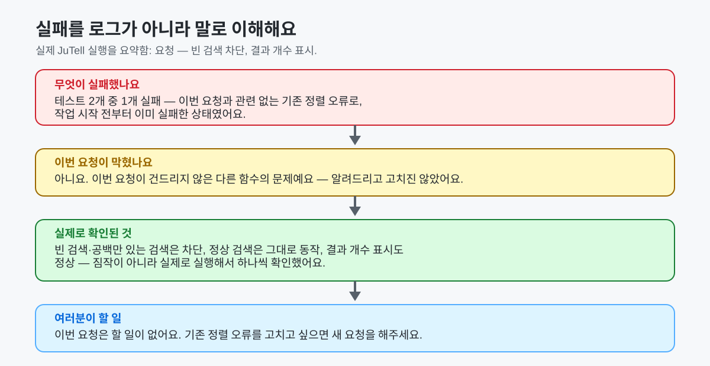

# JuTell — by Ju0

[English](README.md) | **한국어**

## 내가 하려는 말을 Agent에게, Agent가 한 일을 나에게.

AI Agent에게 원하는 걸 말할 수 있지만, 정말 됐는지 알려고 코드나 로그까지 읽고 싶지는 않은
분들을 위해.


**빠른 시작**

```bash
npm install -g jutell
jutell
```

JuTell은 여러분이 이미 쓰는 Coding Agent(Codex·Claude Code·OpenCode) 옆에서, 작업 전에는
프로젝트 사실을 확인하고 작업 후에는 확인된 것과 짐작한 것을 나눠 알려줍니다. Codex·Claude
Code·OpenCode를 제공하지 않고 AI 모델 자체도 아닙니다 — 자세한 내용은 아래
"JuTell이 하는 일과 하지 않는 일"에서 확인하세요.

## JuTell이 푸는 문제

AI Coding Agent 덕분에 코드를 쓰는 건 빨라졌지만, 그보다 오래된 문제 두 가지는 그대로
남았습니다.

- **작업 전:** 내가 정확히 뭘 원하는지 말로 설명하기 어렵고, Agent가 잘못 짐작하면 조용히
  엉뚱한 방향으로 작업이 진행될 수 있습니다.
- **작업 후:** Agent가 실제로 뭘 했는지 알기 어렵습니다. 잔뜩 쌓인 Diff와 "테스트했다"는
  한 문장만으로는 뭐가 진짜고 뭐가 짐작인지 구분되지 않습니다.

JuTell은 그 사이에 있습니다. Coding Agent를 대신하거나 코드를 직접 쓰지 않고, 그 코드를
둘러싼 대화를 양쪽 다 더 분명하게 만듭니다.

## 실제로 이렇게 동작해요


지어낸 대화가 아니라 실제 실행 결과를 요약한 것입니다 — 원문 전체는
[2.0.0 릴리스 쇼케이스](docs/releases/2.0.0-showcase.md)에 있습니다. JuTell이 무엇을 물었는지
보세요: 방금 읽은 실제 가입 화면을 근거로 한 질문 **한 가지**뿐입니다 — "무슨 뜻이에요?" 같은
막연한 질문이 아닙니다.

## Agent가 끝낸 뒤


JuTell은 실제로 확인한 경우에만 "확인됨"이라고 말합니다. 코드만 보고 예상한 것과 브라우저에서
아직 확인하지 못한 것은 항상 분명히 따로 표시합니다 — 전체 원문 보고서는
[릴리스 쇼케이스](docs/releases/2.0.0-showcase.md)에서 볼 수 있습니다.

## 뭔가 잘못됐을 때



각본이 아니라, 관련 없는 기존 테스트가 이미 깨져 있던 실제 실행에서 JuTell이 보인 실제
행동입니다. JuTell은 스스로를 완전한 자동 디버거라고 말하지 않습니다. 원문 로그를 읽게
하는 대신, 그 실패가 **여러분의 요청**에 무엇을 뜻하는지 설명합니다. 전체 원문:
[릴리스 쇼케이스](docs/releases/2.0.0-showcase.md).

## 아직 확인하지 못한 것도 있어요

화면이 실제 브라우저에서 정말 보기 좋은지처럼, 코드만 읽어서는 JuTell이 확인할 수 없는
것도 있습니다. 검색 결과 없음 문구의 스타일을 바꾼 실제 실행은 이렇게 정직하게 보고했습니다.

| | |
|---|---|
| 코드 확인 | ✅ 스타일 값이 실제로 바뀐 것을 확인함 |
| 테스트 확인 | ✅ 기존 테스트가 그대로 통과함 |
| 실제 화면 확인 | ❌ 확인 안 함 — 이번 환경에는 브라우저가 없었음 |
| 여러분이 할 일 | 화면을 한 번 열어 직접 봐 주세요. |

JuTell은 "코드로는 맞아 보인다"를 "화면에서 확인됐다"로 바꿔 말하지 않습니다. 브라우저를
실행하지 않았다면 그렇다고 말하고, 직접 봐 달라고 요청합니다.

## JuTell이 더 시키는 일은 얼마나 될까요?


이건 한 번 관찰한, 표본 1개짜리 비교일 뿐입니다 — JuTell이 항상 일정 배수의 토큰을 쓴다는
주장도, 토큰을 아껴준다는 주장도 아닙니다. 그 실행에서 늘어난 동작은 설정 읽기 1회, Skill
파일 읽기 1회, MCP 호출 1회였습니다. 전체 수치와 한계는
[릴리스 쇼케이스](docs/releases/2.0.0-showcase.md#efficiency-snapshot)에서 확인하세요. 이
오버헤드를 줄이는 것 — 특히 Skill 파일 전체 읽기부터 — 은 이미 끝난 일이 아니라 지금
진행 중인 작업입니다.

## 써 보세요

```bash
npm install -g jutell
jutell
```

위와 똑같은 두 명령이에요 — 여기까지 읽고 써 보고 싶으시다면, 필요한 건 이게 전부예요.

## 지원하는 Agent와 플랫폼

| 필요한 것 | 현재 상태 |
|---|---|
| **Codex** | 정식 지원 |
| **Claude Code** | 베타 |
| **OpenCode** | 베타 |
| Windows | 테스트됨 |
| Ubuntu | 제한적으로 테스트됨 |
| macOS | 사용 가능 / 미검증 |

먼저 Coding Agent가 필요합니다. JuTell은 이미 설치한 Agent에 연결하는 도구이며, Agent나 AI
모델 자체가 아닙니다.

## 설치 전에 준비할 것

다음이 필요합니다.

- **Coding Agent:** Codex, Claude Code 또는 OpenCode가 먼저 설치되어 있어야 합니다. Codex
  연결은 지원하며, Claude Code와 OpenCode는 베타입니다.
- **Node.js:** JuTell은 `npm`으로 설치합니다. npm은 Node.js에 함께 들어 있습니다. 없다면
  [nodejs.org](https://nodejs.org/en/download)에서 현재 Node.js를 설치하세요.
- **터미널:** Windows는 PowerShell, Ubuntu/macOS는 Terminal을 엽니다. 아래 두 명령을
  붙여넣는 창입니다.
- **인터넷 연결:** npm이 설치 중 JuTell을 내려받습니다.

## 설치 방법

위 두 명령을 이미 실행해 보셨나요? 여기서는 각 단계에서 실제로 무엇이 보여야 하는지, 뭔가
이상해 보일 때 무엇을 하면 되는지 — Ubuntu/Linux 권한 오류 해결법을 포함해서 — 자세히
설명합니다.


### 1단계 — PowerShell 또는 Terminal 열기

Windows에서는 시작 메뉴에서 **PowerShell**을 검색해 엽니다. Ubuntu 또는 macOS에서는
**Terminal**을 엽니다.

### 2단계 — JuTell 설치하기

아래를 붙여넣고 Enter를 누르세요.

```bash
npm install -g jutell
```

> **Ubuntu/Linux에서 권한 오류가 나나요?** `EACCES` / `permission denied` 오류가 나면, JuTell만의
> 문제가 아니라 Linux에서 흔한 npm 전역 폴더 소유권 문제입니다. `sudo npm install -g jutell`은
> 피하세요 — root 소유 파일이 남아 다음 설치에서 같은 문제를 반복시킬 수 있습니다. 안전한 해결
> 방법 두 가지는 [Ubuntu/Linux 설치 권한 오류](docs/CLI_INSTALLATION.md)에서 확인하세요.

### 3단계 — JuTell 실행하기

```bash
jutell
```

일반 설치 흐름을 한 번에 붙여넣어도 됩니다.

```bash
npm install -g jutell
jutell
```

### 4단계 — 발견된 Agent 연결 승인하기

JuTell은 컴퓨터에 이미 설치된 Codex·Claude Code·OpenCode를 찾습니다. 짧은 변경 안내를 읽고
연결할 Agent를 승인하세요. JuTell이 관리하는 설정만 다루며, 다른 Agent 설정은 그대로 둡니다.

### 5단계 — 평소 쓰던 Coding Agent로 돌아가기

설정은 터미널에서 끝납니다. 계속 열어 둬야 하는 새 대시보드는 없습니다. Codex·Claude
Code·OpenCode로 돌아가 평소처럼 사용하세요.

### 6단계 — 설치가 잘 된 모습

Agent를 찾고 연결했다는 안내가 오류 없이 보이면 됩니다. 짧은 연결 요약이 필요하면 `jutell
status`를 실행하세요. 문제가 보이면 `jutell doctor`가 다음에 할 일을 알려줍니다.

## 처음 해 볼 요청

바로 눈으로 확인할 수 있는 간단한 요청부터 해 보세요.

1. "로그인 버튼을 파란색으로 바꿔줘."
2. "회원가입 좀 간단하게 해줘."
3. "검색창이 비어 있으면 도움말을 보여줘."

첫 번째와 세 번째 요청은 Agent가 바로 작업해야 합니다. "회원가입 좀 간단하게 해줘"처럼
결과가 크게 달라질 수 있는 요청에서는, JuTell이 프로젝트를 먼저 확인하고 꼭 필요한 결정이
남을 때만 물어야 합니다. 기술적인 설문처럼 많은 질문을 하면 안 됩니다.

## 잘 작동하는지 어떻게 알 수 있나요?

```bash
jutell status
```

이제 막 설치했고 아직 연결하지 않은 실제 프로젝트는 짐작하지 않고 정직하게 이렇게
보여줍니다.

```text
Skill: 설치되지 않음
AGENTS.md: JuTell 블록 없음
Codex MCP: 활성화됨 (전역, 이 프로젝트에서는 아직 사용 안 함)
OpenCode MCP: 미등록
현재 Agent 세션 적용: 직접 확인 필요
```

"설정됨"과 "실제로 확인함"을 나누기 때문에, 아직 도구를 호출해 보지 않은 상태를 오류처럼
보여주지 않습니다.

```bash
jutell doctor
```

설치가 이상해 보일 때 사용하세요. JuTell 파일·설정·권한·컴퓨터 밖으로 전송될 내용이 있는지를
한 줄씩 점검하며, 각 줄을 정상·오류·직접 확인 필요로 표시합니다. 기본 출력에는 전체 경로나
비밀 값을 보여주지 않습니다.

## 문제가 생겼나요?

| 이런 경우 | 이렇게 해 보세요 |
|---|---|
| Agent를 찾지 못함 | 지원되는 Coding Agent를 설치하고 열어 본 뒤 `jutell`을 다시 실행하세요. |
| 연결에 실패함 | `jutell doctor`를 실행하고 안내를 따르세요. |
| 한 Agent를 다시 연결하고 싶음 | `jutell`을 다시 실행하거나, 아래 고급 수동 연결 명령을 사용하세요. |
| JuTell을 끄고 싶음 | `jutell off`를 실행하세요. 설정과 로컬 작업 기록은 남습니다. |
| JuTell을 지우고 싶음 | `jutell uninstall`을 실행하세요. `--remove-data`를 직접 추가하지 않는 한 로컬 데이터는 남습니다. |
| Ubuntu/Linux에서 설치 중 `EACCES`/권한 오류가 남 | [Ubuntu/Linux 설치 권한 오류](docs/CLI_INSTALLATION.md)를 확인하세요. `sudo npm install -g jutell`은 피하세요. |

## JuTell이 하는 일과 하지 않는 일

**JuTell이 하는 일:**
- Coding Agent 옆에서 함께 일하는 소통 레이어
- 작업 전, 결과를 바꾸는 진짜 의도를 분명하게 하는 것
- 작업 후, 실제로 한 일과 근거를 설명하는 것

**JuTell이 하지 않는 일:**
- AI 모델 자체가 되는 것
- Coding Agent를 대신하는 것
- 코드가 맞다고 보증하는 것
- 완전한 자동 디버거가 되는 것
- 여러 Agent를 지휘하는 오케스트레이터가 되는 것

**무엇이 바뀌었는지**, **무엇을 확인했는지**, **코드만 보고 예상한 것은 무엇인지**, **아직
확인하지 못한 것은 무엇인지**를 섞지 않습니다. Agent 결과가 맞다고 보증하지 않고, 모든
의존성을 찾는다고 약속하지 않으며, 브라우저 동작을 자동으로 확인하지도, 승인 여부를 대신
결정하지도 않습니다.

## 신뢰와 개인정보

JuTell은 여러분 컴퓨터에 이미 있는 파일·Git·명령 결과를 바탕으로 작업을 설명합니다. 프로젝트
코드, Prompt, Agent 원문 답변, Diff, 비밀정보를 수집하거나 외부로 보내지 않습니다. Telemetry는
기본으로 꺼져 있으며, 이 단계에서는 저장이나 외부 전송도 구현되어 있지 않습니다.

자세한 내용은 [개인정보 원칙](docs/PRIVACY_PRINCIPLES.md)을, 제품의 전체 범위와 한계는
[제품 범위](docs/PRODUCT_SCOPE.md)에서 확인하세요.

## 최신 소식

**`jutell@2.0.0`**은 npm에 공개되었습니다. 이제 작업이 끝난 뒤뿐 아니라 시작하기 전에도
돕습니다. 프로젝트 사실을 먼저 확인하고, 진짜 결정만 물으며, 확인됨 / 예상 / 미확인을 섞지
않습니다.

실제 보고서, 실제 실패 사례, 정직한 효율 스냅샷, 이번 릴리스의 알려진 한계는
[2.0.0 릴리스 쇼케이스](docs/releases/2.0.0-showcase.md)에서 확인하세요 — 마케팅 문구가 아니라
실제 출력 그대로입니다.

## 설치·제어·고급 명령

### 자주 쓰는 명령

| 명령 | 하는 일 |
|---|---|
| `jutell` | 설치된 지원 Agent를 찾아 연결할지 물어봅니다. |
| `jutell status` | 설치·연결·Profile·Feature 상태를 보여줍니다. |
| `jutell doctor` | 설치 문제를 점검합니다. |
| `jutell on` / `jutell off` | JuTell 연결을 켜거나 끕니다. |
| `jutell setup` | Skill·기본 설정·MCP 연결을 다시 준비합니다. |
| `jutell provider` | Agent별 연결 상태를 자세히 보여줍니다. |
| `jutell upgrade` | 설치된 Skill/설정/MCP를 최신 버전으로 새로고침합니다. |
| `jutell uninstall` | JuTell이 관리하는 설정을 제거합니다. |

MCP는 Coding Agent가 JuTell을 더 직접적으로 사용할 수 있게 하는 선택형 로컬 연결입니다.
일반 설치에는 MCP를 이해하거나 직접 설정할 필요가 없습니다. MCP가 꺼져 있어도 JuTell의
보고 방식은 계속 사용할 수 있습니다. 기술적인 내용은 [CLI 설치 안내](docs/CLI_INSTALLATION.md)와
[MCP 연결](docs/MCP_INTEGRATION.md)을 참고하세요.

CLI가 만들어 주는 프로젝트의 `.jutell.json`으로 보고 방식을 조절할 수 있습니다. `minimal`,
`balanced`, `learning`, `detailed` Profile은 설명 길이만 바꾸며, 사실이나 위험 판단을 바꾸지
않습니다.

npm이 아니라 저장소 소스를 직접 검증하는 기여자라면 `packages/cli`에서 `npm pack`을
실행했을 때 `jutell-2.0.0.tgz`가 만들어집니다. 일반 사용자는 이 경로가 필요 없습니다.

기여자용 문서: [Changelog](CHANGELOG.md) · [문서 지도](docs/DOCUMENTATION_MAP.md) ·
[OpenCode 연결](docs/PROVIDER_OPENCODE.md) ·
[GitHub Releases](https://github.com/ju0o/jutell/releases)

## JuTell by Ju0

Ju0는 상위 브랜드이며 JuTell은 그 제품입니다.

[](https://www.npmjs.com/package/jutell)
[](LICENSE)
[](https://nodejs.org)
