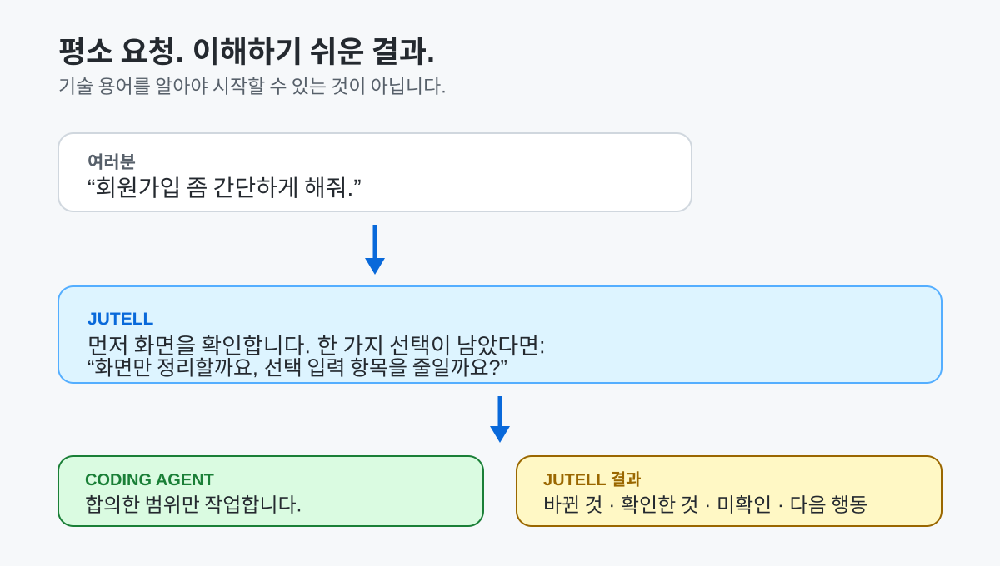
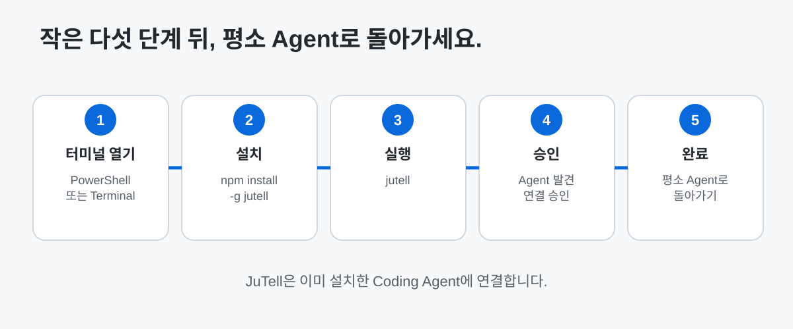
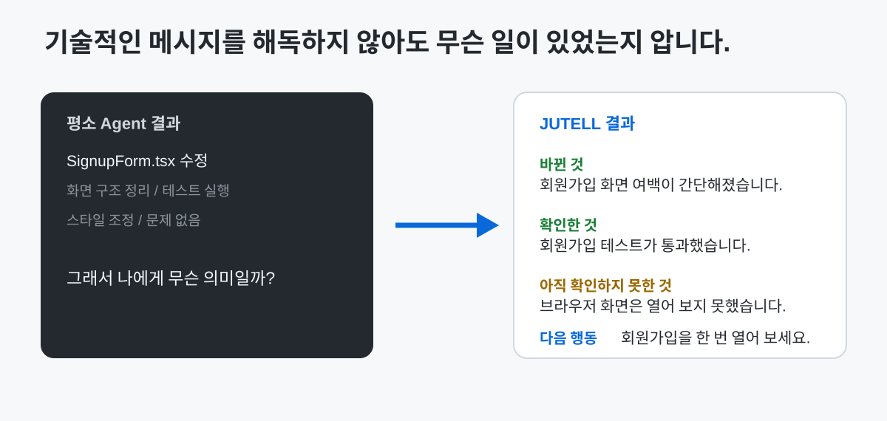

# JuTell — by Ju0

[English](README.md) | **한국어**

> AI 코딩을 시작했다면, 이제 나와 Coding Agent가 서로 제대로 이해하는지 확인하세요.

JuTell은 요청이 애매할 때, 그리고 Agent의 작업 결과가 어려울 때 그 사이를 돕습니다. 프로젝트에서 직접 확인할 수 있는 사실은 먼저 확인하고, 결과를 정말 바꾸는 결정만 물은 뒤, 작업을 짧고 정직한 말로 설명해 줍니다.

평소 쓰던 Coding Agent는 그대로 사용합니다. JuTell은 Codex·Claude Code·OpenCode를 제공하지 않습니다. 이미 설치한 Agent를 더 분명하게 쓸 수 있게 돕는 도구입니다.



## 30초 예시

**여러분:** “회원가입 좀 간단하게 해줘.”

**JuTell:** 지금 가입 화면과 꼭 필요한 입력 항목을 먼저 확인합니다. “간단하게”가 서로 다른 결과를 만들 수 있을 때만, “화면만 정리할까요, 선택 입력 항목을 줄일까요?”처럼 쉬운 질문을 한 번 합니다.

**여러분:** “화면만 정리해 줘. 입력 항목은 그대로 둘래.”

**Coding Agent:** 작업합니다.

**JuTell:** 무엇이 바뀌었는지, 실제로 확인한 것은 무엇인지, 아직 직접 확인하지 못한 것은 무엇인지, 여러분이 다음에 할 일이 있는지를 알려줍니다.

## JuTell을 쓸 수 있나요?

| 필요한 것 | 현재 상태 |
|---|---|
| **Codex** | 정식 지원 |
| **Claude Code** | 베타 |
| **OpenCode** | 베타 |
| Windows | 테스트됨 |
| Ubuntu | 제한적으로 테스트됨 |
| macOS | 사용 가능 / 미검증 |

먼저 Coding Agent가 필요합니다. JuTell은 이미 설치한 Agent에 연결하는 도구이며, Agent나 AI 모델 자체가 아닙니다.

## 설치 전에 준비할 것

다음이 필요합니다.

- **Coding Agent:** Codex, Claude Code 또는 OpenCode가 먼저 설치되어 있어야 합니다. Codex 연결은 지원하며, Claude Code와 OpenCode는 베타입니다.
- **Node.js:** JuTell은 `npm`으로 설치합니다. npm은 Node.js에 함께 들어 있습니다. 없다면 [nodejs.org](https://nodejs.org/en/download)에서 현재 Node.js를 설치하세요.
- **터미널:** Windows는 PowerShell, Ubuntu/macOS는 Terminal을 엽니다. 아래 두 명령을 붙여넣는 창입니다.
- **인터넷 연결:** npm이 설치 중 JuTell을 내려받습니다.

## 설치 방법



### 1단계 — PowerShell 또는 Terminal 열기

Windows에서는 시작 메뉴에서 **PowerShell**을 검색해 엽니다. Ubuntu 또는 macOS에서는 **Terminal**을 엽니다.

### 2단계 — JuTell 설치하기

아래를 붙여넣고 Enter를 누르세요.

```bash
npm install -g jutell
```

### 3단계 — JuTell 실행하기

```bash
jutell
```

일반 설치 흐름을 한 번에 붙여넣어도 됩니다.

```bash
npm install -g jutell
jutell
```

### 4단계 — 발견된 Agent 연결 승인하기

JuTell은 컴퓨터에 이미 설치된 Codex·Claude Code·OpenCode를 찾습니다. 짧은 변경 안내를 읽고 연결할 Agent를 승인하세요. JuTell이 관리하는 설정만 다루며, 다른 Agent 설정은 그대로 둡니다.

### 5단계 — 평소 쓰던 Coding Agent로 돌아가기

설정은 터미널에서 끝납니다. 계속 열어 둬야 하는 새 대시보드는 없습니다. Codex·Claude Code·OpenCode로 돌아가 평소처럼 사용하세요.

### 6단계 — 설치가 잘 된 모습

Agent를 찾고 연결했다는 안내가 오류 없이 보이면 됩니다. 짧은 연결 요약이 필요하면 `jutell status`를 실행하세요. 문제가 보이면 `jutell doctor`가 다음에 할 일을 알려줍니다.

## 처음 해 볼 요청

바로 눈으로 확인할 수 있는 간단한 요청부터 해 보세요.

1. “로그인 버튼을 파란색으로 바꿔줘.”
2. “회원가입 좀 간단하게 해줘.”
3. “검색창이 비어 있으면 도움말을 보여줘.”

첫 번째와 세 번째 요청은 Agent가 바로 작업해야 합니다. “회원가입 좀 간단하게 해줘”처럼 결과가 크게 달라질 수 있는 요청에서는, JuTell이 프로젝트를 먼저 확인하고 꼭 필요한 결정이 남을 때만 물어야 합니다. 기술적인 설문처럼 많은 질문을 하면 안 됩니다.

## Agent가 끝낸 뒤



작업이 작으면 보고서도 이렇게 짧습니다.

```text
바뀐 것
- 회원가입 화면의 여백을 간단하게 정리했습니다. 입력 항목은 그대로입니다.

확인한 것
- 회원가입 화면 테스트가 통과했습니다.

아직 확인하지 못한 것
- 실제 브라우저에서 화면을 열어 보지는 못했습니다.

여러분이 할 일
- 회원가입 화면을 한 번 열어 새 여백을 확인해 주세요.
```

JuTell은 실제로 확인한 경우에만 “확인됨”이라고 말합니다. 코드만 보고 예상한 것과 브라우저에서 아직 확인하지 못한 것은 분명히 따로 표시합니다.

## 잘 작동하는지 어떻게 알 수 있나요?

```bash
jutell status
```

JuTell 설치와 Agent 연결을 읽기 쉬운 요약으로 보여줍니다. “설정됨”과 “실제로 확인함”을 나누기 때문에, 아직 도구를 호출해 보지 않은 상태를 오류처럼 보여주지 않습니다.

```bash
jutell doctor
```

설치가 이상해 보일 때 사용하세요. JuTell 파일·설정·권한·컴퓨터 밖으로 전송될 내용이 있는지를 점검합니다. 기본 출력에는 전체 경로나 비밀 값을 보여주지 않습니다.

## 문제가 생겼나요?

| 이런 경우 | 이렇게 해 보세요 |
|---|---|
| Agent를 찾지 못함 | 지원되는 Coding Agent를 설치하고 열어 본 뒤 `jutell`을 다시 실행하세요. |
| 연결에 실패함 | `jutell doctor`를 실행하고 안내를 따르세요. |
| 한 Agent를 다시 연결하고 싶음 | `jutell`을 다시 실행하거나, 아래 고급 수동 연결 명령을 사용하세요. |
| JuTell을 끄고 싶음 | `jutell off`를 실행하세요. 설정과 로컬 작업 기록은 남습니다. |
| JuTell을 지우고 싶음 | `jutell uninstall`을 실행하세요. `--remove-data`를 직접 추가하지 않는 한 로컬 데이터는 남습니다. |

## JuTell이 하는 일과 하지 않는 일

JuTell은 작업 전에 요청을 분명하게 하고, 작업 뒤에는 결과를 이해하기 쉽게 합니다. **무엇이 바뀌었는지**, **무엇을 확인했는지**, **코드만 보고 예상한 것은 무엇인지**, **아직 확인하지 못한 것은 무엇인지**를 섞지 않습니다.

Coding Agent를 대신하지 않고, AI 모델을 제공하지 않으며, Agent 결과가 맞다고 보증하지 않습니다. 모든 의존성을 찾는다고 약속하지 않고, 브라우저 동작을 자동으로 확인하지도 않으며, 승인 여부를 대신 결정하지도 않습니다.

## 신뢰와 개인정보

JuTell은 여러분 컴퓨터에 이미 있는 파일·Git·명령 결과를 바탕으로 작업을 설명합니다. 프로젝트 코드, Prompt, Agent 원문 답변, Diff, 비밀정보를 수집하거나 외부로 보내지 않습니다. Telemetry는 기본으로 꺼져 있으며, 이 단계에서는 저장이나 외부 전송도 구현되어 있지 않습니다.

자세한 내용은 [개인정보 원칙](docs/PRIVACY_PRINCIPLES.md)을, 제품의 전체 범위와 한계는 [제품 범위](docs/PRODUCT_SCOPE.md)에서 확인하세요.

## 최신 소식

**`jutell@2.0.0`은 npm에 공개됨.** 이제 작업이 끝난 뒤뿐 아니라 시작하기 전에도 돕습니다. 프로젝트 사실을 먼저 확인하고, 진짜 결정만 물으며, 확인됨 / 예상 / 미확인을 섞지 않습니다.

## 설치·제어·고급 명령

### 자주 쓰는 명령

| 명령 | 하는 일 |
|---|---|
| `jutell` | 설치된 지원 Agent를 찾아 연결할지 물어봅니다. |
| `jutell status` | 설치·연결·Profile·Feature 상태를 보여줍니다. |
| `jutell doctor` | 설치 문제를 점검합니다. |
| `jutell on` / `jutell off` | JuTell 연결을 켜거나 끕니다. |
| `jutell setup` | Skill·기본 설정·MCP 연결을 다시 준비합니다. |
| `jutell provider` | Agent별 연결 상태를 자세히 보여줍니다. |
| `jutell upgrade` | 설치된 Skill/설정/MCP를 최신 버전으로 새로고침합니다. |
| `jutell uninstall` | JuTell이 관리하는 설정을 제거합니다. |

MCP는 Coding Agent가 JuTell을 더 직접적으로 사용할 수 있게 하는 선택형 로컬 연결입니다. 일반 설치에는 MCP를 이해하거나 직접 설정할 필요가 없습니다. MCP가 꺼져 있어도 JuTell의 보고 방식은 계속 사용할 수 있습니다. 기술적인 내용은 [CLI 설치 안내](docs/CLI_INSTALLATION.md)와 [MCP 연결](docs/MCP_INTEGRATION.md)을 참고하세요.

CLI가 만들어 주는 프로젝트의 `.jutell.json`으로 보고 방식을 조절할 수 있습니다. `minimal`, `balanced`, `learning`, `detailed` Profile은 설명 길이만 바꾸며, 사실이나 위험 판단을 바꾸지 않습니다.

npm이 아니라 저장소 소스를 직접 검증하는 기여자라면 `packages/cli`에서 `npm pack`을 실행했을 때 `jutell-2.0.0.tgz`가 만들어집니다. 일반 사용자는 이 경로가 필요 없습니다.

기여자용 문서: [Changelog](CHANGELOG.md) · [문서 지도](docs/DOCUMENTATION_MAP.md) · [OpenCode 연결](docs/PROVIDER_OPENCODE.md) · [GitHub Releases](https://github.com/ju0o/jutell/releases)

## JuTell by Ju0

Ju0는 상위 브랜드이며 JuTell은 그 제품입니다.
