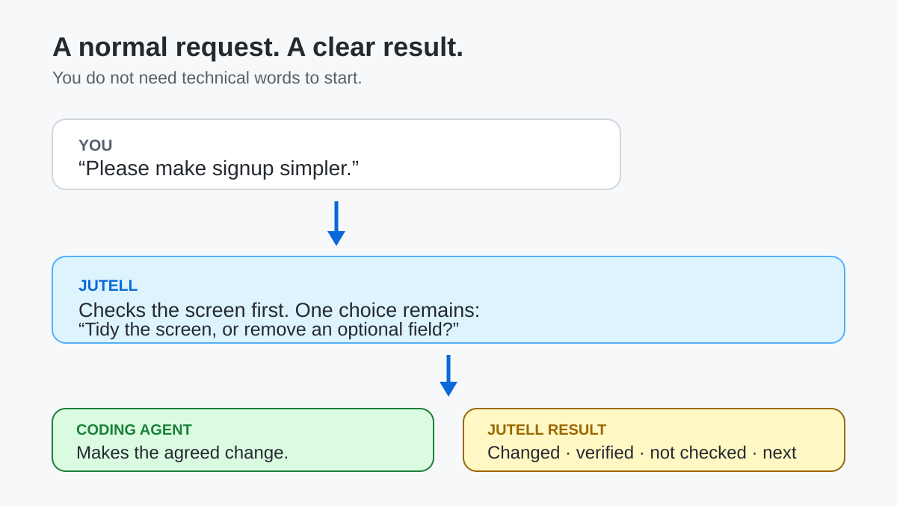
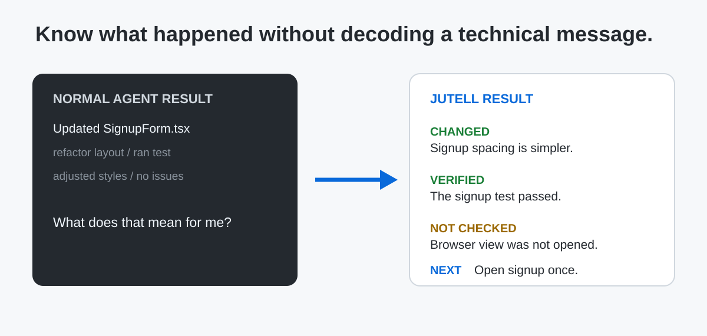
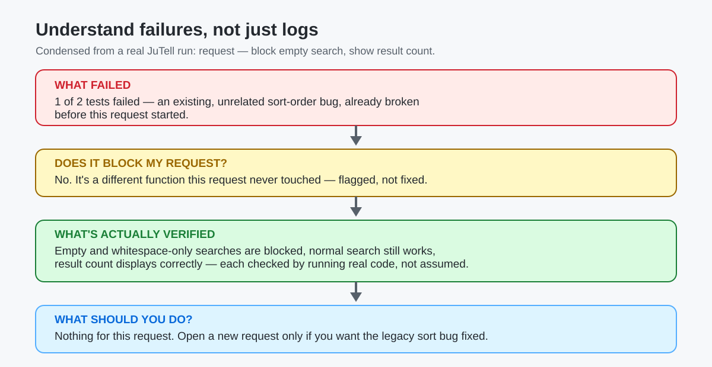
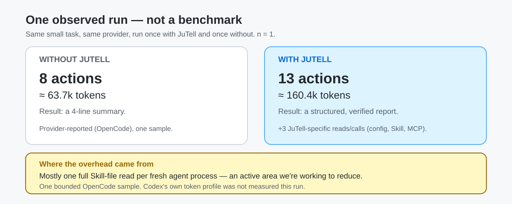
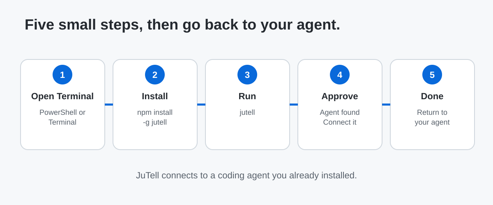

# JuTell — by Ju0

**English** | [한국어](README.ko.md)

[](https://www.npmjs.com/package/jutell)
[](LICENSE)
[](https://nodejs.org)


## Tell your agent what you mean. Understand what it did.

JuTell sits beside a coding agent you already use — Codex, Claude Code, or OpenCode. Before work,
it checks project facts it can find itself and asks only the one decision that actually changes
the result. After work, it gives you a short, honest report: what changed, what was actually
verified, and what you still need to check yourself.

JuTell does not provide Codex, Claude Code, or OpenCode, and it is not an AI model. It helps you
use one of them with more clarity, in both directions.


```bash
npm install -g jutell
jutell
```

## The problem JuTell solves

AI coding agents made writing code faster. They didn't fix two older problems:

- **Before work:** it's hard to explain exactly what you mean, and an agent that guesses wrong
  can quietly do the wrong thing.
- **After work:** it's hard to tell what an agent actually did — a wall of diffs and "I tested it"
  don't tell you what's real and what's assumed.

JuTell sits in that gap. It doesn't replace your coding agent or write code itself — it makes the
conversation around the code clearer, on both ends.

## See it in action



This is condensed from an actual run, not invented dialogue — the full raw output is in the
[2.0.0 release showcase](docs/releases/2.0.0-showcase.md). Notice what JuTell asked: **one**
question, grounded in the real form it had just read — not a generic "what do you mean?"

## After your agent finishes



JuTell does not call something "verified" unless it actually checked it. A code-based expectation
and an unchecked browser result stay clearly labeled, every time — see the full raw report in the
[release showcase](docs/releases/2.0.0-showcase.md).

## When something goes wrong



This is JuTell's real behavior on a run where a pre-existing, unrelated test was already broken —
not a scripted demo. JuTell doesn't claim to be a full autonomous debugger; it explains what a
failure means for **your** request instead of leaving you to read raw test output. Full raw output:
[release showcase](docs/releases/2.0.0-showcase.md).

## When something can't be checked yet

Some things — like whether a screen actually looks right in a real browser — JuTell cannot confirm
by reading code alone. A real run that changed an empty-search message's styling reported it
honestly:

| | |
|---|---|
| Code checked | ✅ the style values actually changed |
| Test checked | ✅ the existing test still passed |
| Real browser view | ❌ not checked — no browser was available |
| Your action | Open the screen once and look. |

JuTell does not turn "looks right in code" into "confirmed on screen." If it didn't run a browser,
it says so, and asks you to look.

## What extra work does JuTell add?



This is one bounded, single-sample comparison — not a claim that JuTell always costs a fixed
multiple of tokens, and not a claim that it saves tokens either. The extra actions in that run were
a config read, a Skill-file read, and one MCP call. Full numbers and caveats:
[release showcase](docs/releases/2.0.0-showcase.md#efficiency-snapshot). Reducing that overhead —
starting with the full Skill-file read — is an active area of work, not something already solved.

## Can I use JuTell?

| What you need | Current status |
|---|---|
| **Codex** | Supported |
| **Claude Code** | Beta |
| **OpenCode** | Beta |
| Windows | Tested |
| Ubuntu | Limited testing |
| macOS | Available / unverified |

You need a coding agent first. JuTell connects to an agent you already installed; it is not the
agent or the AI model itself.

## Before installing

You need:

- **A coding agent:** Codex, Claude Code, or OpenCode already installed. Codex is the fully
  supported connection; Claude Code and OpenCode are Beta.
- **Node.js:** JuTell is installed with `npm`, which comes with Node.js. If you do not have it,
  install the current Node.js release from [nodejs.org](https://nodejs.org/en/download).
- **A terminal:** PowerShell on Windows, or Terminal on Ubuntu/macOS. It is just the place where
  you paste the two commands below.
- **Internet access:** npm downloads JuTell during installation.

## Install, step by step



### Step 1 — Open PowerShell or Terminal

On Windows, search for **PowerShell** and open it. On Ubuntu or macOS, open **Terminal**.

### Step 2 — Install JuTell

Paste this, then press Enter:

```bash
npm install -g jutell
```

> **Permission error on Ubuntu/Linux?** If this fails with `EACCES` / `permission denied`, it's a
> common npm global-folder ownership issue on Linux, not something specific to JuTell. Avoid
> `sudo npm install -g jutell` — it can leave root-owned files that cause the same problem again
> later. See [Ubuntu/Linux install permission error](docs/CLI_INSTALLATION.md) for two safe fixes.

### Step 3 — Run JuTell

```bash
jutell
```

Or paste the normal install path together:

```bash
npm install -g jutell
jutell
```

### Step 4 — Approve the detected agent connection

JuTell looks for Codex, Claude Code, and OpenCode that are already on your computer. Read the short
preview and approve the connection you want. It only manages JuTell's own setup blocks and keeps
other agent settings in place.

### Step 5 — Return to your normal coding agent

Setup finishes in the terminal. There is no new dashboard you must keep open. Go back to Codex,
Claude Code, or OpenCode and use it as usual.

### Step 6 — What successful setup looks like

You should see that an agent was found and connected, without an error. Then run `jutell status` if
you want a short connection summary. If it says there is a problem, run `jutell doctor` for the
next step to take.

## First things to try

Start with a request you can recognize easily:

1. "Change the login button to blue."
2. "Please make signup simpler."
3. "Make the empty search box show a helpful message."

For the first and third, JuTell should let your agent get on with a clear request. For "make signup
simpler," it should check the project first and ask only if a real choice remains. It should not
turn your request into a technical questionnaire.

## How do I know it is working?

```bash
jutell status
```

A real, freshly installed, not-yet-connected project reports honestly instead of guessing:

```text
Skill: not installed
AGENTS.md: no JuTell block
Codex MCP: enabled (globally, not yet used from this project)
OpenCode MCP: not registered
Current agent session applied: needs direct confirmation
```

It separates "configured" from "actually checked," so an untested tool call is not presented as a
failure.

```bash
jutell doctor
```

Use this when setup looks wrong. It checks JuTell files, configuration, permissions, and whether
anything would be sent outside your computer, line by line, each marked OK, error, or needs a
closer look. Its normal output avoids showing full paths or secret values.

## Something went wrong

| If this happens | Try this |
|---|---|
| No agent was found | Install and open a supported coding agent first, then run `jutell` again. |
| Connection failed | Run `jutell doctor`, then follow its message. |
| You want to reconnect one agent | Run `jutell` again, or use the manual connection commands in Advanced. |
| You want to turn JuTell off | Run `jutell off`. Your settings and local journal stay. |
| You want to remove JuTell | Run `jutell uninstall`. It keeps local data unless you explicitly add `--remove-data`. |
| `EACCES` / permission denied installing on Ubuntu/Linux | See [Ubuntu/Linux install permission error](docs/CLI_INSTALLATION.md). Avoid `sudo npm install -g jutell`. |

## What JuTell is — and is not

**JuTell is:**
- a communication layer beside your coding agent
- something that helps clarify material intent before work starts
- something that explains actual work and evidence after it finishes

**JuTell is not:**
- an AI model
- a replacement coding agent
- a correctness guarantee
- a full autonomous debugger
- a multi-agent orchestrator

It keeps **what changed**, **what was verified**, **what is expected**, and **what was not
checked** separate, and it does not guarantee agent correctness, find every dependency, verify
browser behavior automatically, or make the approval decision for you.

## Trust and privacy

JuTell explains work using files, Git, and command output already on your computer. It does not
collect or send your project code, prompts, raw agent answers, diffs, or secrets. Telemetry is off
by default, and storage or transmission for it is not implemented at this stage.

Read the details in [Privacy principles](docs/PRIVACY_PRINCIPLES.md). For the full scope and
limitations, see [Product scope](docs/PRODUCT_SCOPE.md).

## What's new

**`jutell@2.0.0`** is published on npm. It helps before work starts as well as after it finishes:
project facts are checked first, only a real decision is asked, and verified / expected /
not-checked remain separate.

See the [2.0.0 release showcase](docs/releases/2.0.0-showcase.md) for a real report, a real
failure, an honest efficiency snapshot, and this release's known limits — not marketing copy, the
actual output.

## Install, control & advanced

### Useful commands

| Command | What it does |
|---|---|
| `jutell` | Finds installed supported agents and offers to connect them. |
| `jutell status` | Shows installation, connection, profile, and feature status. |
| `jutell doctor` | Checks setup problems. |
| `jutell on` / `jutell off` | Turns JuTell's connection on or off. |
| `jutell setup` | Prepares the Skill, default config, and MCP connection again. |
| `jutell provider` | Shows detailed agent connection status. |
| `jutell upgrade` | Refreshes JuTell's installed Skill/config/MCP to the current version. |
| `jutell uninstall` | Removes JuTell's managed setup. |

MCP is an optional local connection that lets a coding agent use JuTell more directly. You do not
need to understand or configure it for the normal install path; JuTell's reporting fallback remains
available if MCP is off. See [CLI install & commands](docs/CLI_INSTALLATION.md) and
[MCP integration](docs/MCP_INTEGRATION.md) when you need the technical details.

You can tune reports with a project `.jutell.json` file created by the CLI. Available profiles are
`minimal`, `balanced`, `learning`, and `detailed`; they change explanation length, never the
underlying facts or risk.

If you are verifying the repository source instead of installing from npm, `npm pack` creates
`jutell-2.0.0.tgz` in `packages/cli`; ordinary users do not need this path.

For contributors: [Changelog](CHANGELOG.md) · [Documentation map](docs/DOCUMENTATION_MAP.md) ·
[OpenCode connection](docs/PROVIDER_OPENCODE.md) ·
[GitHub Releases](https://github.com/ju0o/jutell/releases)

## JuTell by Ju0

Ju0 is the parent brand; JuTell is its product.
