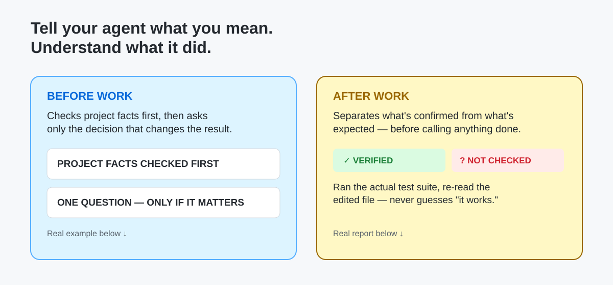

# JuTell — by Ju0

**AI는 코드를 만들고, JuTell은 사람이 그 작업을 이해하고 판단하고 다음 작업으로 이어가게 합니다.**

코딩 에이전트의 작업 결과는 종종 길고 기술적입니다. JuTell은 이미 쓰는 Agent 옆에서 결과를 사람이 읽을 수 있는 보고서로 정리합니다. 무엇이 바뀌었는지, 무엇이 실제로 확인됐는지, 아직 모르는 것은 무엇인지, 다음에 무엇을 하면 되는지를 한곳에 보여줍니다.



JuTell은 AI 모델, IDE, Agent GUI가 아닙니다. Agent를 대체하거나 작업을 중계하지 않는 **설명·검증·이어가기 레이어**입니다.

```bash
npm install -g jutell
cd <project-folder>
jutell use codex
```

OpenCode는 `jutell use opencode`, Claude Code는 `jutell use claude`를 사용합니다. npm에 현재 공개된 버전은 **`jutell@1.0.0`**입니다.

## 그래서 JuTell을 쓰면 무엇이 좋아지나요?


| Agent의 원래 결과 | JuTell이 정리하는 결과 |
|---|---|
| 기술 용어와 작업 나열 | 무엇이 바뀌었는지 |
| “테스트했다”는 한 문장 | 확인된 근거와 아직 확인하지 못한 범위 |
| 큰 Diff 전체 | 중요한 코드 1~2개와 쉬운 설명 |
| 대화를 다시 읽어야 하는 인수인계 | 다음 Agent에 붙여넣을 수 있는 현재 상태 |

비개발자도 “승인해도 되는가?”, “무엇을 직접 확인해야 하는가?”를 판단할 수 있게 하는 것이 목적입니다.

## 실제 보고서 형태

아래는 JuTell의 공개 보고 규칙을 따르는 **정제된 예시**입니다. 실제 사용자·프로젝트·세션 데이터를 사용하지 않았습니다.


```text
[무엇이 바뀌었나요?]
검색어가 비어 있으면 검색 요청을 보내지 않도록 바뀌었습니다.

[중요한 코드]
  + if (!query.trim()) return;
  - 쉬운 설명: 공백만 있는 검색어는 여기서 멈춥니다.
  - 영향: 빈 검색으로 인한 불필요한 요청과 오류 화면을 줄입니다.

[확인된 것과 아직 모르는 것]
- 확인됨 (근거: 파일, 테스트) — 빈 값 차단 코드와 테스트를 확인했습니다.
- 예상 (근거: 코드 예상) — 빈 검색 요청이 발생하지 않을 것으로 예상됩니다.
- 확인하지 못함 — 실제 브라우저 동작은 아직 확인하지 못했습니다.
- 위험도: 낮음 — 검색 제출 동작에만 영향을 줍니다.

[다음 행동]
브라우저에서 빈 검색을 한 번 실행해 확인해 주세요.
보고서 상태: 추가 확인 필요
```

보고서 길이는 작업 규모에 맞춥니다. 단순한 변경에 긴 문서를 강요하지 않지만, 실패·위험·미확인 항목은 숨기지 않습니다.

## 중요한 코드도 읽을 수 있게

JuTell은 전체 Diff를 다시 보여주는 도구가 아닙니다. 이미 확인한 변경 중 의미 있는 코드 최대 1~2개를 골라, 왜 중요한지와 사용자에게 어떤 영향이 있는지 설명합니다.


코드만 보고 알 수 있는 내용은 **예상**으로 남기고, 실제 화면이나 실행으로 확인한 결과와 섞지 않습니다.

## 믿을 수 있는 것과 아직 모르는 것

“통과” 한 단어만으로는 충분하지 않습니다. JuTell은 근거, 확인 상태, 위험도, 사용자 행동을 서로 다른 정보로 다룹니다.


- **확인됨** — 파일, Git, 명령, 브라우저 같은 직접 근거가 있습니다.
- **예상** — 코드상 그렇게 보이지만 실제 실행으로 확인하지 않았습니다.
- **미확인** — 검증하지 않았거나 검증 수단이 없습니다.
- **위험도** — 영향 범위를 따로 판단합니다. 확인 여부와 같은 뜻이 아닙니다.

이 구분은 다음 Agent에게도 이어집니다. JuTell의 handoff는 완료된 것, 근거, 미확인 사항, 다음 행동을 짧게 전달합니다. 새 Agent가 이미 검증한 것처럼 꾸미지 않습니다.

## Agent 연결

JuTell은 Codex, OpenCode, Claude Code와 같은 제품 지원 대상으로 연결합니다.

| Provider | 최근 Acceptance 범위 | 연결 명령 |
|---|---|---|
| **Codex** | Configured / Connected / Live MCP Used / runtime E2E 확인 | `jutell use codex` |
| **OpenCode** | Configured / Connected / Live MCP Used / runtime E2E 확인 | `jutell use opencode` |
| **Claude Code** | Configured / Connected / Live MCP Used / runtime E2E 확인 | `jutell use claude` |

최근 `JUTELL-V1-PROVIDER-E2E-ACCEPTANCE-01`에서는 세 Provider가 LEVEL D 실제 runtime E2E를 통과했습니다. 이는 검증한 환경과 시나리오의 결과이며, 모든 OS·모든 로컬 설정·모든 Provider 버전에서의 동작을 보장한다는 뜻은 아닙니다.

Skill(보고 규칙)이 기본 경로이고 MCP는 선택형 로컬 연결입니다. MCP 연결이 꺼지거나 실패해도 Skill 기반 보고 규칙은 사용할 수 있습니다. `jutell doctor`로 설치와 연결 준비 상태를 점검할 수 있습니다.

## 설치

**요구 사항:** Node.js 18 이상과 `npm`

```bash
npm install -g jutell
cd <project-folder>

# 사용하는 Agent 하나를 연결합니다.
jutell use codex
# jutell use opencode
# jutell use claude
```

설치 후에는 평소처럼 Agent에게 작업을 맡기면 됩니다. 작업 결과를 보고할 때 JuTell 규칙이 사람이 읽을 수 있는 형태를 안내합니다.

<details>
<summary>개발자·기여자용 로컬 tarball 설치</summary>

일반 사용자는 위의 npm 설치를 사용하세요. 저장소에서 다음 공개 후보를 검증할 때만 사용합니다.

```bash
cd packages/cli
npm install
npm pack
npm install -g ./jutell-1.0.1.tgz
```

`1.0.1`은 이 저장소의 소스 후보 버전이며, 이 README 작성 시점에 npm registry에 공개된 최신 버전은 `jutell@1.0.0`입니다.
</details>

## JuTell이 하는 일과 하지 않는 일

JuTell은 Agent가 이미 남긴 파일, Git diff, 명령 결과를 바탕으로 설명합니다. 프로젝트 코드·프롬프트·Agent 답변 원문·diff·비밀정보를 자동 수집하거나 외부로 전송하지 않습니다. Telemetry는 기본 OFF이며, 현재 단계에서 저장·외부 전송을 구현하지 않았습니다.

JuTell이 하지 않는 일: AI 모델 제공, API gateway, Agent GUI 복제, 인증 대행, Codex·OpenCode·Claude Code 대체, 오케스트레이션.

## 내 입맛대로 조절하기

설정 파일은 프로젝트 루트의 `.jutell.json` (없으면 기존 `.beginner-bridge.json` 호환) 하나입니다. CLI나 로컬 관리자에서 생성하며, 공개 저장소에 커밋하지 않는 로컬 설정입니다.

```json
{
  "version": 1,
  "profile": "balanced",
  "voice": { "preset": "default" }
}
```

| 조절 항목 | 선택지 | 의미 |
|---|---|---|
| Profile | `minimal` / `balanced` / `learning` / `detailed` | 보고서의 길이와 설명량 |
| Voice | `default` / `plain` / `learning` / `jutell` | 말투만 변경. 사실·검증·위험은 바꾸지 않음 |
| Features | `explainedDiff`, `validationResults`, `riskAssessment` 등 | 필요한 보고 항목을 켜고 끔 |

예를 들어 `jutell on` / `jutell off`로 연결을 켜고 끄고, `jutell status`로 Profile·Feature·연결 상태를 확인할 수 있습니다. 전체 명령은 `jutell --help`와 [CLI 설치 안내](docs/CLI_INSTALLATION.md)를 참고하세요.

## 지원 환경과 검증 범위

- **Windows: VERIFIED** — Windows 11에서 공개 npm 설치, `jutell use codex`, `status`/`doctor`, MCP 서버 도구 응답, 로컬 관리자 실행을 검증했습니다.
- **Linux (Ubuntu Native): 공개 패키지 최소 스모크 VERIFIED** — `npm install -g jutell` 공개 패키지 기준 최소 CLI/Provider 연결 스모크와 현재 dogfood 근거가 있습니다. 다른 배포판과 모든 lifecycle 명령까지 검증한 것은 아닙니다.
- **macOS: AVAILABLE / UNVERIFIED** — Node 기준으로 구현되어 있으나 실제 macOS에서 설치·연결·MCP 호출을 검증하지 않았습니다.

Node 이식성만으로 macOS 또는 모든 환경이 검증됐다고 주장하지 않습니다.

## 자주 쓰는 명령

| 명령 | 역할 |
|---|---|
| `jutell` | 처음 시작·연결·로컬 관리자 화면 준비 |
| `jutell use codex` | Codex 연결 |
| `jutell use opencode` | OpenCode 연결 |
| `jutell use claude` | Claude Code 연결 |
| `jutell on` / `jutell off` | 연결 켜기 / 끄기 |
| `jutell status` | 현재 연결·Profile·Feature 상태 확인 |
| `jutell doctor` | 설치·설정·권한·외부 전송 여부 점검 |

고급 명령: `setup`, `enable`, `disable`, `uninstall`, `provider`, `dashboard`, `upgrade`, `migrate`, `session`. 기존 사용자를 위해 `beginner-bridge`도 호환 별칭으로 유지합니다.

## 문서

- [시작하기](docs/START_HERE.md)
- [CLI 설치 안내](docs/CLI_INSTALLATION.md)
- [제품 범위](docs/PRODUCT_SCOPE.md)
- [Feature 설정](docs/FEATURE_CONFIGURATION.md)
- [JuTell 말투 정책](docs/JUTELL_STYLE.md)
- [개인정보 원칙](docs/PRIVACY_PRINCIPLES.md)
- [Telemetry 정책](docs/TELEMETRY_POLICY.md)
- [MCP 연결](docs/MCP_INTEGRATION.md)
- [OpenCode 연결](docs/PROVIDER_OPENCODE.md)

## JuTell by Ju0

Ju0는 상위 브랜드, JuTell은 그 아래 제품입니다. 공식 표기는 `JuTell by Ju0`입니다. GitHub 저장소 이름 변경은 별도 운영 결정으로 유지됩니다.
