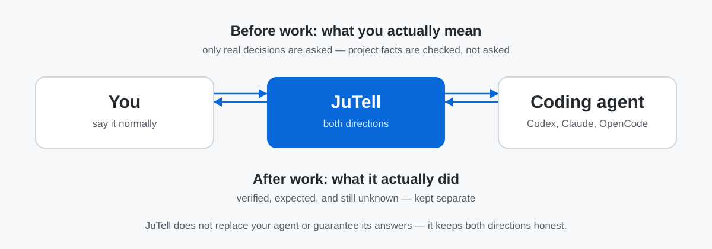

# JuTell — by Ju0

**English** | [한국어](README.ko.md)

**Tell your coding agent what you actually mean — and understand what it actually did.**

You say what you want, normally. Before work starts, JuTell notices only the ambiguity that would actually change the result, checks everything it can determine from your project itself, and asks you at most one real decision. After work finishes, it reports what changed, what was actually verified, what's still unknown, and what needs you — in words a non-developer can act on.



**Before work** — JuTell clarifies only decisions that materially matter, looks up project facts itself instead of asking you technical questions, and protects the scope you asked for.

**After work** — JuTell explains what changed, keeps verified / expected / not-checked strictly separate, and tells you what still needs your attention.

JuTell is not an AI model, an IDE, or an agent GUI. It doesn't replace your agent, relay your work to it, or guarantee your agent's answers are correct — it's a **two-way communication layer** that sits beside the agent you're already using: you → agent, then agent → you.

## Install

```bash
npm install -g jutell
jutell
```

JuTell finds the coding agents you already have installed (Codex, Claude Code, OpenCode), asks for one approval, connects them, and hands you straight back to your normal Codex / Claude Code / OpenCode session. No wizard, no dashboard tab to close.

<details>
<summary>Build from source instead (contributors / verifying the repo directly)</summary>

Most people should use the npm install above. Use this only when you want to verify the source in this repository directly.

```bash
cd packages/cli
npm install
npm pack
npm install -g ./jutell-2.0.0.tgz
```

`2.0.0` matches this repository's current source version and the current published `jutell@2.0.0` on npm.
</details>

## What does JuTell actually do?

One flow, both directions:

1. You ask normally — e.g. "회원가입 좀 간단하게 해줘."
2. JuTell notices only the ambiguity that would change the result.
3. The agent checks what it can determine itself (current screens, fields, code) instead of asking you.
4. If a real decision remains, you get one concise question — never a technical quiz.
5. The agent changes only what you asked for, plus the supporting work strictly needed for it.
6. Verification is tied to what you actually asked for — not the whole test suite just because it exists.
7. You get a short report: what changed, what's verified, what's still unknown, what needs you.

### After your agent finishes, JuTell answers what matters

| Question | What JuTell shows |
|---|---|
| What changed? | A plain-language summary of the change, not a wall of diffs. |
| What was verified? | Only checks that were actually run — never "probably works." |
| What's still uncertain? | Named explicitly, instead of being quietly skipped. |
| Which code actually matters, and why? | 1–2 important snippets, explained — not the whole diff. |
| Is there risk? | A plain risk read, judged by impact, not by whether a test exists. |
| What should I do next? | Up to 3 concrete actions, only when something is genuinely left for you. |
| Can another agent continue this? | A copy-pasteable handoff with what's known and what isn't. |

## Before / after


| What your agent gives you | What JuTell gives you |
|---|---|
| Technical terms and a list of actions | What actually changed |
| One line saying "tested it" | What's confirmed, and what still isn't |
| An entire raw diff | 1–2 important lines, explained simply |
| A handoff that means re-reading the whole conversation | A current-state summary you can paste into the next agent |

The point: a nondeveloper can decide "is this okay to approve?" and "what do I need to check myself?" — without reading code.

### The other half: before work starts

| You say | What JuTell + your agent do |
|---|---|
| "회원가입 좀 간단하게 해줘." | Check the current signup structure first — no "which framework?" questions. |
| The risky guess: what does "간단하게" mean? | Ask only the decision that changes the outcome (e.g. tidy up the screen vs. remove an input) — one question, then work. |
| The quiet risk: scope creep. | Change only the authorized scope, verify against what you asked for, and report the rest honestly. |

No workflow diagram to memorize — this is the same single flow as above: clarify only what matters, change only what's asked, verify only what's relevant.

## Example report

The rules below are JuTell's real, public reporting rules. This example is sanitized — no real project, user, or session data.


```text
[What changed]
An empty search no longer sends a request.

[Important code]
  + if (!query.trim()) return;
  - In plain terms: a search box with only spaces now stops here.
  - Impact: fewer unnecessary requests and error screens from empty searches.

[Confirmed vs. still unknown]
- Confirmed (evidence: file, test) — the empty-input guard and its test were checked.
- Expected (evidence: code) — no empty search requests should occur.
- Not yet checked — actual browser behavior hasn't been run.
- Risk: low — affects only search submission.

[Next action]
Try one empty search in the browser to confirm.
Report status: needs one more check
```

A report's length matches the size of the work — a one-line fix doesn't get a wall of text — but failures, risks, and unverified items are never hidden to keep it short.

### Read the important change, not the whole diff


JuTell doesn't dump the full diff back at you. It picks up to 1–2 changes that actually matter from what was already reviewed, and explains why they matter and what changes for you. Anything that can only be inferred from reading the code stays labeled as an **expectation** — it's never mixed in with something actually confirmed by running it.

## Works with your existing agents

| Agent | Status |
|---|---|
| **Codex** | Supported |
| **Claude Code** | Beta |
| **OpenCode** | Beta |

"Beta" means the connection itself is newer and less battle-tested — the reports you get are held to the same rules regardless of which agent you connect. `jutell` (see [Install](#install) above) connects whichever of these it finds; to connect one specific agent by hand, see [Install, control & advanced](#install-control--advanced) below. Verification details live in [CLI install & commands](docs/CLI_INSTALLATION.md) and [MCP integration](docs/MCP_INTEGRATION.md) for anyone who wants them; the README keeps it to this table on purpose.

Reporting rules are the default path, and MCP is an optional local connection alongside them — if MCP is off or unavailable, you still get JuTell's reports. Run `jutell doctor` any time to check what's connected.

## Trust: what's confirmed, and what isn't


A single word like "passed" isn't enough. JuTell keeps evidence, confirmation status, risk, and what you should do as four separate things:

- **Confirmed** — backed by something direct: a file, Git, a command, a browser check.
- **Expected** — looks right from the code, but wasn't actually run.
- **Not checked** — wasn't verified, or there was no way to verify it.
- **Risk** — judged separately from confirmation status. Something can be fully confirmed and still be high-risk.

This carries into handoffs too. A JuTell handoff passes along what's done, the evidence for it, what's still unknown, and the next action — briefly. It never lets a new agent pretend something was already verified when it wasn't.

## Install, control & advanced

**Everyday commands**

| Command | What it does |
|---|---|
| `jutell` | First run: find and connect your installed agents. |
| `jutell status` | Check current connections, Profile, and Features. |
| `jutell doctor` | Check for setup problems. |
| `jutell on` / `jutell off` | Turn the connection on or off. |

**Manual connection, repair, and advanced**

Use these if auto-connect didn't run, you want to reconnect one specific agent, or you're troubleshooting:

| Command | What it does |
|---|---|
| `jutell use codex` / `jutell use opencode` / `jutell use claude` | Connect (or reconnect) one specific agent by hand. |
| `jutell dashboard` | Open the local admin screen on demand. |
| `jutell setup` / `jutell enable` / `jutell disable` | Redo setup, or turn Skill/MCP on or off individually. |
| `jutell provider` | See detailed per-agent connection status. |
| `jutell upgrade` | Refresh the installed Skill/config/MCP to the current version. |
| `jutell uninstall` | Remove the install. |
| `jutell session` | See today's local work log. |

You can adjust how JuTell reports without touching any of this — see the config block below.

```json
{
  "version": 1,
  "profile": "balanced",
  "voice": { "preset": "default" }
}
```

| Setting | Choices | What it changes |
|---|---|---|
| Profile | `minimal` / `balanced` / `learning` / `detailed` | Report length and how much is explained |
| Voice | `default` / `plain` / `learning` / `jutell` | Tone only — never facts, evidence, or risk |
| Features | `explainedDiff`, `validationResults`, `riskAssessment`, etc. | Which report sections are on |

This file lives at your project's `.jutell.json`, is created by the CLI or local admin screen, and is never committed to this public repository. Full command reference: `jutell --help` or [CLI install & commands](docs/CLI_INSTALLATION.md).

## Privacy

JuTell explains what your agent already did, from files, Git, and command output already on your machine. It does not collect or transmit your project code, prompts, raw agent answers, diffs, or secrets. Telemetry is off by default, and storage/transmission for it isn't implemented at this stage. Full details: [Privacy principles](docs/PRIVACY_PRINCIPLES.md) and [Telemetry policy](docs/TELEMETRY_POLICY.md).

What JuTell doesn't do: provide an AI model, act as an API gateway, clone an agent GUI, handle authentication for you, replace Codex/Claude Code/OpenCode, or orchestrate other agents.

What JuTell doesn't promise: it doesn't guarantee your agent understood you correctly, doesn't claim to find every dependency your request touches, doesn't certify code correctness on its own, and never replaces your judgment on whether to approve the result. It makes the request clearer and the evidence checkable — the final call stays yours.

## Platform support

| Platform | Status |
|---|---|
| **Windows** | Tested — install, connect, status/doctor, and the local admin screen all verified on Windows 11. |
| **Linux (Ubuntu)** | Tested in our current Ubuntu setup — a smaller smoke check on the published npm package, not every command on every distro. |
| **macOS** | Available, but not yet verified by us — it's built on Node and should work, but we haven't confirmed install/connect/MCP on real macOS. |

Being written in Node doesn't by itself mean every platform is verified — the table above is the honest state, not an assumption.

## What's new

**`jutell@2.0.0` — published on npm**

JuTell now helps *before* your agent starts, not only after it finishes:

- It checks project facts itself and asks you only the decisions that actually change the outcome — at most one concise question.
- It protects your requested scope: what you asked for, plus strictly necessary supporting work. Unrelated "improvements" are left alone (mentioned at most once, never silently done).
- Completion is verified against what you actually asked for, with already-gathered evidence reused — no unrelated test-suite runs just because they exist.
- The easy-to-read report you know stays: verified / expected / not-checked kept separate, plus what still needs you.
- Install, providers, and platforms are unchanged: `npm install -g jutell` then `jutell`; Codex supported, Claude Code and OpenCode beta.

**`jutell@1.1.0`** (previous release)

- Bare `jutell` now finds and connects every supported coding agent on your machine in one step, with a single approval — no per-agent setup wizard for a normal first run.
- Setup returns you straight to your terminal instead of opening the local dashboard automatically (`jutell dashboard` is still there whenever you want it).
- This README and README.ko.md were rewritten for a global, bilingual audience.

Full version history: [GitHub Releases](https://github.com/ju0o/jutell/releases).

## Docs

- [Changelog](CHANGELOG.md)
- [Get started](docs/START_HERE.md)
- [CLI install & commands](docs/CLI_INSTALLATION.md)
- [Product scope](docs/PRODUCT_SCOPE.md)
- [Feature configuration](docs/FEATURE_CONFIGURATION.md)
- [JuTell voice/tone policy](docs/JUTELL_STYLE.md)
- [Privacy principles](docs/PRIVACY_PRINCIPLES.md)
- [Telemetry policy](docs/TELEMETRY_POLICY.md)
- [MCP integration](docs/MCP_INTEGRATION.md)
- [OpenCode connection](docs/PROVIDER_OPENCODE.md)

Engineering audits, operator logs, and early planning notes are kept in the repository for transparency but aren't part of the beginner journey — see [`docs/DOCUMENTATION_MAP.md`](docs/DOCUMENTATION_MAP.md) if you're looking for them.

## JuTell by Ju0

Ju0 is the parent brand; JuTell is the product under it. The official form is `JuTell by Ju0`. The GitHub repository name is kept as-is as a separate operational decision.
