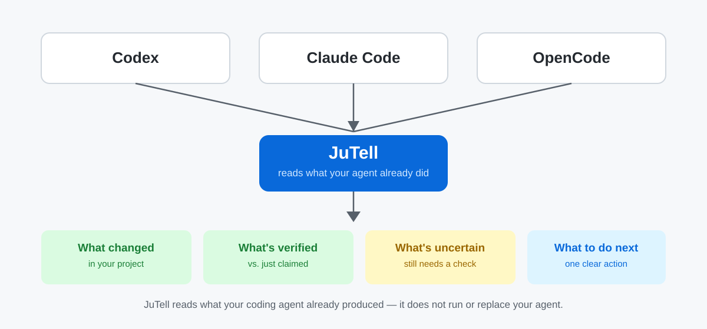
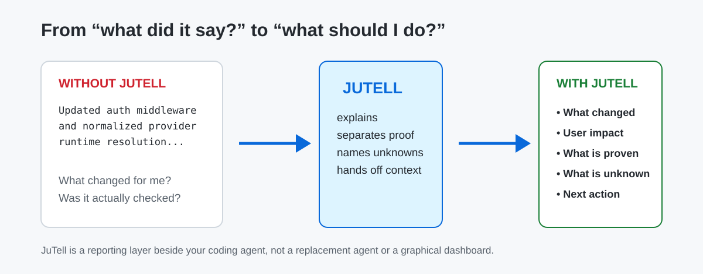
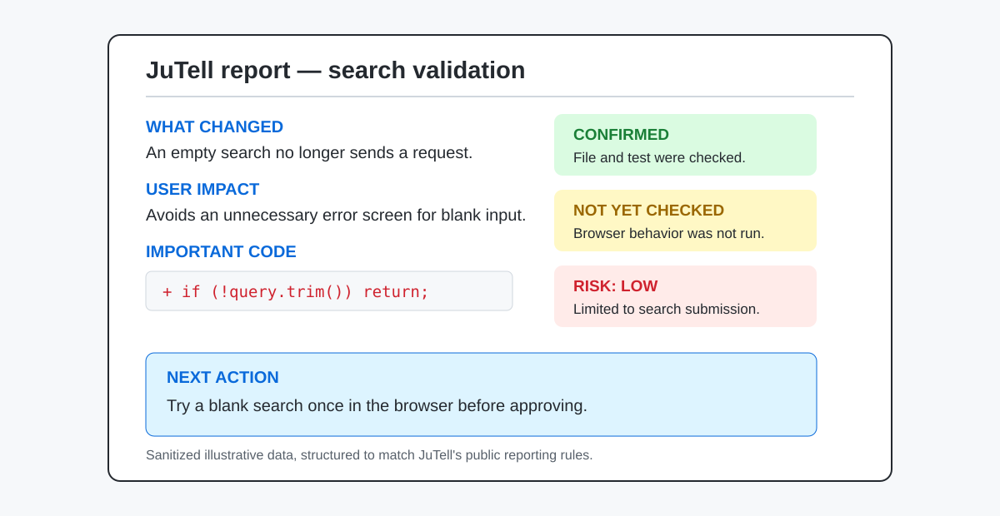
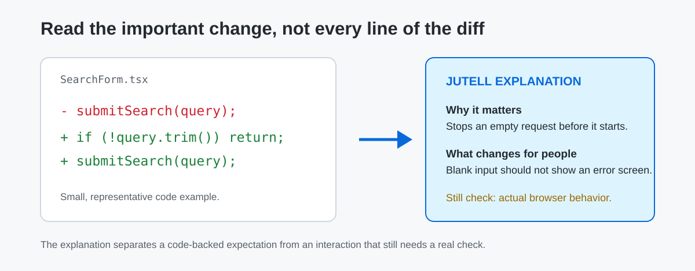
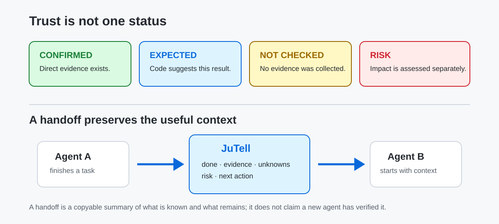

# JuTell — by Ju0

**English** | [한국어](README.ko.md)

**Your coding agent writes the code. JuTell helps you understand what happened.**

Coding agents like Codex, Claude Code, and OpenCode leave long, technical results behind. JuTell sits beside the agent you already use and turns that result into a report a person can actually read: what changed, what's actually been checked, what's still unknown, and what to do next.



JuTell is not an AI model, an IDE, or an agent GUI. It doesn't replace your agent or relay your work to it — it's an **explain, verify, and hand-off layer** that sits beside the agent you're already using.

## Install

```bash
npm install -g jutell
jutell
```

JuTell finds the coding agents you already have installed (Codex, Claude Code, OpenCode), asks for one approval, connects them, and hands you straight back to your normal Codex / Claude Code / OpenCode session. No wizard, no dashboard tab to close.

> This describes JuTell's current behavior on GitHub `main`. The npm package published today, `jutell@1.0.1`, still uses an older one-agent setup wizard that opens a local dashboard at the end — see **[What's new](#whats-new)** below for the exact difference until the next release ships.

<details>
<summary>Build from source instead (contributors / verifying the repo directly)</summary>

Most people should use the npm install above. Use this only when you want to verify the source in this repository directly.

```bash
cd packages/cli
npm install
npm pack
npm install -g ./jutell-1.0.1.tgz
```

`1.0.1` matches this repository's current source version and today's published `jutell@1.0.1` on npm.
</details>

## What does JuTell actually do?

After your agent finishes a task, JuTell answers the questions that actually matter to you:

| Question | What JuTell shows |
|---|---|
| What changed? | A plain-language summary of the change, not a wall of diffs. |
| What was verified? | Only checks that were actually run — never "probably works." |
| What's still uncertain? | Named explicitly, instead of being quietly skipped. |
| Which code actually matters, and why? | 1–2 important snippets, explained — not the whole diff. |
| Is there risk? | A plain risk read, judged by impact, not by whether a test exists. |
| What should I do next? | Up to 3 concrete actions, only when something is genuinely left for you. |
| Can another agent continue this? | A copy-pasteable handoff with what's known and what isn't. |

## Before / after



| What your agent gives you | What JuTell gives you |
|---|---|
| Technical terms and a list of actions | What actually changed |
| One line saying "tested it" | What's confirmed, and what still isn't |
| An entire raw diff | 1–2 important lines, explained simply |
| A handoff that means re-reading the whole conversation | A current-state summary you can paste into the next agent |

The point: a nondeveloper can decide "is this okay to approve?" and "what do I need to check myself?" — without reading code.

## Example report

The rules below are JuTell's real, public reporting rules. This example is sanitized — no real project, user, or session data.



```text
[What changed]
An empty search no longer sends a request.

[Important code]
  + if (!query.trim()) return;
  - In plain terms: a search box with only spaces now stops here.
  - Impact: fewer unnecessary requests and error screens from empty searches.

[Confirmed vs. still unknown]
- Confirmed (evidence: file, test) — the empty-input guard and its test were checked.
- Expected (evidence: code) — no empty search requests should occur.
- Not yet checked — actual browser behavior hasn't been run.
- Risk: low — affects only search submission.

[Next action]
Try one empty search in the browser to confirm.
Report status: needs one more check
```

A report's length matches the size of the work — a one-line fix doesn't get a wall of text — but failures, risks, and unverified items are never hidden to keep it short.

### Read the important change, not the whole diff



JuTell doesn't dump the full diff back at you. It picks up to 1–2 changes that actually matter from what was already reviewed, and explains why they matter and what changes for you. Anything that can only be inferred from reading the code stays labeled as an **expectation** — it's never mixed in with something actually confirmed by running it.

## Works with your existing agents

| Agent | Status |
|---|---|
| **Codex** | Supported |
| **Claude Code** | Beta |
| **OpenCode** | Beta |

"Beta" means the connection itself is newer and less battle-tested — the reports you get are held to the same rules regardless of which agent you connect. `jutell` (see [Install](#install) above) connects whichever of these it finds; to connect one specific agent by hand, see [Install, control & advanced](#install-control--advanced) below. Verification details live in [CLI install & commands](docs/CLI_INSTALLATION.md) and [MCP integration](docs/MCP_INTEGRATION.md) for anyone who wants them; the README keeps it to this table on purpose.

Reporting rules are the default path, and MCP is an optional local connection alongside them — if MCP is off or unavailable, you still get JuTell's reports. Run `jutell doctor` any time to check what's connected.

## Trust: what's confirmed, and what isn't



A single word like "passed" isn't enough. JuTell keeps evidence, confirmation status, risk, and what you should do as four separate things:

- **Confirmed** — backed by something direct: a file, Git, a command, a browser check.
- **Expected** — looks right from the code, but wasn't actually run.
- **Not checked** — wasn't verified, or there was no way to verify it.
- **Risk** — judged separately from confirmation status. Something can be fully confirmed and still be high-risk.

This carries into handoffs too. A JuTell handoff passes along what's done, the evidence for it, what's still unknown, and the next action — briefly. It never lets a new agent pretend something was already verified when it wasn't.

## Install, control & advanced

**Everyday commands**

| Command | What it does |
|---|---|
| `jutell` | First run: find and connect your installed agents. |
| `jutell status` | Check current connections, Profile, and Features. |
| `jutell doctor` | Check for setup problems. |
| `jutell on` / `jutell off` | Turn the connection on or off. |

**Manual connection, repair, and advanced**

Use these if auto-connect didn't run, you want to reconnect one specific agent, or you're troubleshooting:

| Command | What it does |
|---|---|
| `jutell use codex` / `jutell use opencode` / `jutell use claude` | Connect (or reconnect) one specific agent by hand. |
| `jutell dashboard` | Open the local admin screen on demand. |
| `jutell setup` / `jutell enable` / `jutell disable` | Redo setup, or turn Skill/MCP on or off individually. |
| `jutell provider` | See detailed per-agent connection status. |
| `jutell upgrade` | Refresh the installed Skill/config/MCP to the current version. |
| `jutell uninstall` | Remove the install. |
| `jutell session` | See today's local work log. |

You can adjust how JuTell reports without touching any of this — see the config block below.

```json
{
  "version": 1,
  "profile": "balanced",
  "voice": { "preset": "default" }
}
```

| Setting | Choices | What it changes |
|---|---|---|
| Profile | `minimal` / `balanced` / `learning` / `detailed` | Report length and how much is explained |
| Voice | `default` / `plain` / `learning` / `jutell` | Tone only — never facts, evidence, or risk |
| Features | `explainedDiff`, `validationResults`, `riskAssessment`, etc. | Which report sections are on |

This file lives at your project's `.jutell.json`, is created by the CLI or local admin screen, and is never committed to this public repository. Full command reference: `jutell --help` or [CLI install & commands](docs/CLI_INSTALLATION.md).

## Privacy

JuTell explains what your agent already did, from files, Git, and command output already on your machine. It does not collect or transmit your project code, prompts, raw agent answers, diffs, or secrets. Telemetry is off by default, and storage/transmission for it isn't implemented at this stage. Full details: [Privacy principles](docs/PRIVACY_PRINCIPLES.md) and [Telemetry policy](docs/TELEMETRY_POLICY.md).

What JuTell doesn't do: provide an AI model, act as an API gateway, clone an agent GUI, handle authentication for you, replace Codex/Claude Code/OpenCode, or orchestrate other agents.

## Platform support

| Platform | Status |
|---|---|
| **Windows** | Tested — install, connect, status/doctor, and the local admin screen all verified on Windows 11. |
| **Linux (Ubuntu)** | Tested in our current Ubuntu setup — a smaller smoke check on the published npm package, not every command on every distro. |
| **macOS** | Available, but not yet verified by us — it's built on Node and should work, but we haven't confirmed install/connect/MCP on real macOS. |

Being written in Node doesn't by itself mean every platform is verified — the table above is the honest state, not an assumption.

## What's new

**Published on npm — `jutell@1.0.1`**
Install with `npm install -g jutell`, then run `jutell` for an interactive wizard: pick one coding agent, pick a report style, and JuTell opens the local admin screen when setup finishes.

**On GitHub `main` — not yet published**
Bare `jutell` now auto-detects every supported agent on your machine, asks for one approval, connects all of them, and returns you straight to your terminal — no wizard, no dashboard. This is the flow described earlier in this README. If you installed from npm today, you'll see the wizard-and-dashboard flow above until this ships in the next release.

Full version history: [GitHub Releases](https://github.com/ju0o/jutell/releases).

## Docs

- [Get started](docs/START_HERE.md)
- [CLI install & commands](docs/CLI_INSTALLATION.md)
- [Product scope](docs/PRODUCT_SCOPE.md)
- [Feature configuration](docs/FEATURE_CONFIGURATION.md)
- [JuTell voice/tone policy](docs/JUTELL_STYLE.md)
- [Privacy principles](docs/PRIVACY_PRINCIPLES.md)
- [Telemetry policy](docs/TELEMETRY_POLICY.md)
- [MCP integration](docs/MCP_INTEGRATION.md)
- [OpenCode connection](docs/PROVIDER_OPENCODE.md)

Engineering audits, operator logs, and early planning notes are kept in the repository for transparency but aren't part of the beginner journey — see [`docs/DOCUMENTATION_MAP.md`](docs/DOCUMENTATION_MAP.md) if you're looking for them.

## JuTell by Ju0

Ju0 is the parent brand; JuTell is the product under it. The official form is `JuTell by Ju0`. The GitHub repository name is kept as-is as a separate operational decision.
